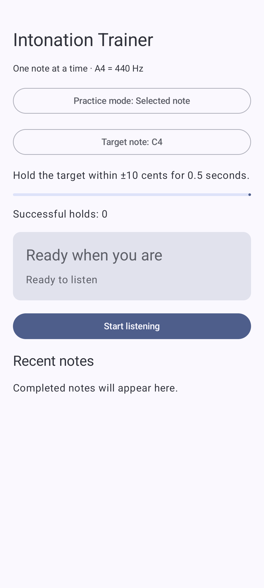
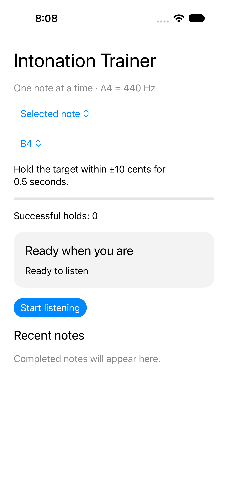
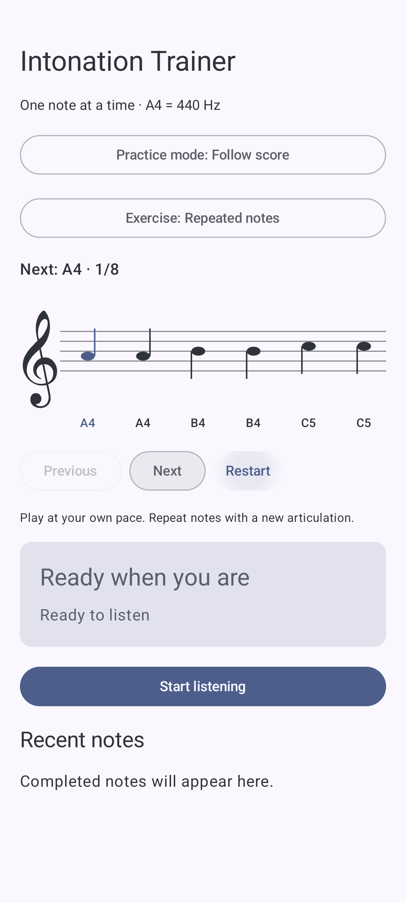
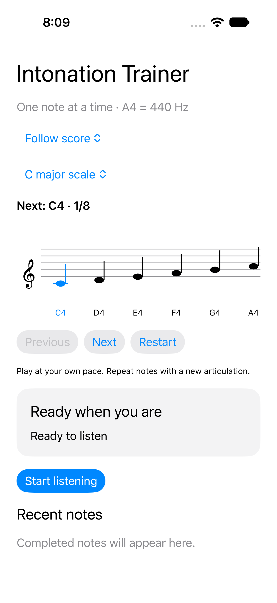

# MVP software validation

Validated on October 7, 2026. This records software evidence, not physical-device acoustic certification.

## Implemented

Both platforms include live monophonic pitch detection, note/octave identification, signed cents, a centered meter, confidence/silence rejection, three practice modes, completed-note history, and foreground-only microphone sessions. Bundled scores render a treble staff with quarter/half-note durations, a next-note highlight, and manual navigation.

The practice model retains the sounding event's target after advancing the score cursor. Selected-note success requires a new articulation to begin another attempt. Starting listening resets history, score position, completion, and attempt state while retaining the selected mode/target/exercise.

Audio is processed in memory. No production audio-file writer, upload path, or networking dependency is used. Android has no INTERNET permission.

## Executed checks

| Check | Environment | Result |
|---|---|---|
| Android debug build | Android Studio bundled Java runtime; Gradle 9.6; compile SDK 37 | Passed |
| Android unit tests | JVM; production Kotlin core and fake capture source | 19 passed: 13 practice/audio tests, 5 lifecycle tests, 1 template sanity test |
| Android instrumented tests | Medium Phone API 37 emulator | 2 passed: practice-screen navigation and app-context check |
| Swift core tests | Swift 6.4, release configuration, macOS host | 13 passed against the same production Swift core compiled into the iOS app |
| iOS simulator build | Xcode 27, iOS deployment target 15 | Passed |
| iOS UI tests | iPhone 18 Pro simulator, iOS 27 | 1 passed: mode/target selection and score navigation, with screenshot attachments |
| Visual inspection | UI-test screenshots from both platforms | Selected-note and score screens checked for readable controls and notation |

The 13 practice/audio tests include 114 tone recipes, labeled event fixtures, synthetic waveform-to-history integration, vibrato, amplitude rearticulation, silence/noise, hold reset/latching, wrong octaves, score target retention, completion, manual navigation, confidence gating, hysteresis, and history bounds. See [fixture definitions](../fixtures/README.md).

UI tests do not grant microphone permission or validate real capture. Android lifecycle tests use a fake source. The iOS controller's real microphone lifecycle is still covered by the manual checks below, not by the portable Swift core suite.

The existing Android Espresso 3.5.1 test dependency could not run against API 37 because it reflected a removed InputManager method. It was updated to 3.7.0, whose [official release notes](https://developer.android.com/jetpack/androidx/releases/test#espresso-3.7.0) document the getSystemService fix.

## Reproduce

From the repository root:

```bash
bash scripts/check.sh
```

For Android UI tests, start an emulator or connect a test device, then run `./gradlew connectedDebugAndroidTest` in `Android/` with the JDK described in the README. Gradle writes XML and HTML results into `Android/app/build/`.

For iOS UI tests:

```bash
xcodebuild -project "IOS/Intonation Trainer.xcodeproj" \
  -scheme "Intonation Trainer" \
  -destination 'platform=iOS Simulator,name=iPhone 18 Pro' \
  -derivedDataPath /tmp/intonation-mvp-ios \
  CODE_SIGNING_ALLOWED=NO test
```

Choose an installed simulator name. The shared scheme includes the UI-test target. The screenshots below were captured by the automated tests, not by a simulated design mockup.

| Android | iOS |
|---|---|
|  |  |
|  |  |

## Open release gates: physical phones

No physical Android phone or iPhone was available during implementation. Do not mark these as passed based on emulator or synthetic results.

For each platform, record phone model, OS version, instrument/source, sample rate, microphone route, and observations:

- [ ] Deny microphone access, recover through Settings, then retry successfully.
- [ ] Complete ten microphone start/stop cycles without crashes, stuck indicators, or automatic restarts.
- [ ] Background the app and interrupt audio (for example, a call); ensure it releases capture and requires an explicit restart.
- [ ] Play low, middle, and high sustained notes on at least one instrument or voice within E2–C6; assess pitch stability and octave mistakes.
- [ ] Measure acoustic onset-to-stable-display latency of ≤250 ms and silence-to-cleared-display latency of ≤500 ms, using a synchronized test-tone source and a video/time reference. Log repetitions and worst-case results.
- [ ] Verify selected A4 against A4 and A5, a 500 ms hold, a sustained successful note, pitch drift, and a new articulation.
- [ ] Play all three scores, including wrong notes, detuning, repeated articulations, manual recovery, completion, and stop/restart resetting to note one.
- [ ] Check repeated same-pitch attacks without silence and ordinary vibrato on the instrument; adjust onset/confidence thresholds only with regression fixtures for any observed failure.
- [ ] Check CPU responsiveness and background cleanup during a sustained practice session. Device performance has not been established by host test timing.

The MVP remains unreleased until these checks meet the README's acceptance criteria on both physical platforms.
